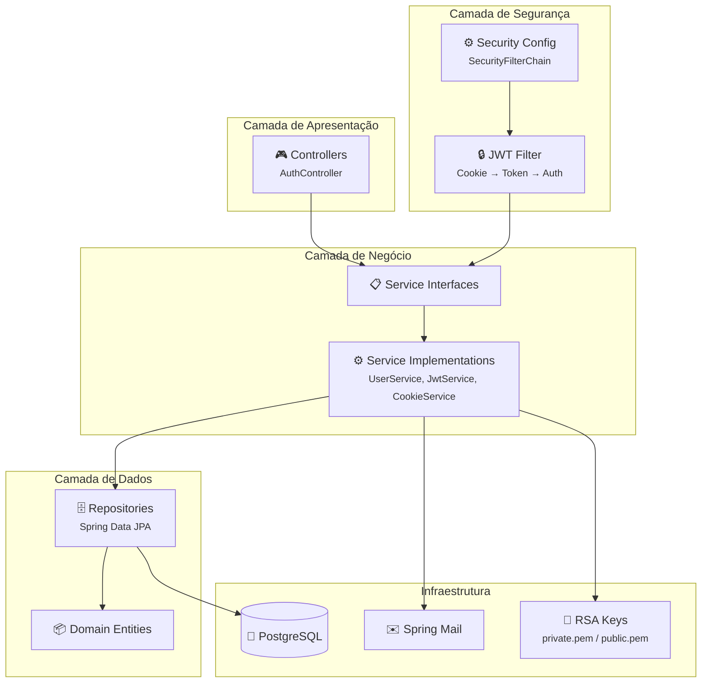
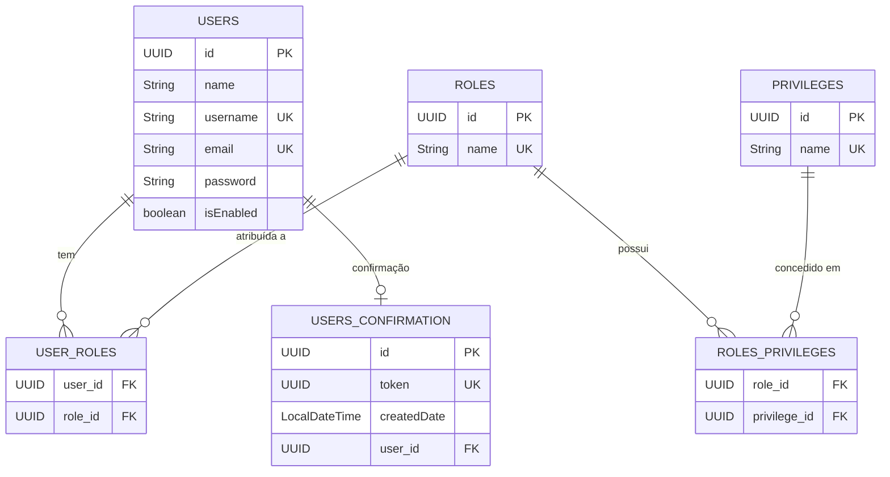

<p align="center">
  
  
  
  
  
  
  
  
</p>

<h1 align="center">🔐 Spring Boot Auth</h1>

<p align="center">
  <strong>API REST de autenticação e autorização com Spring Security, JWT RSA256 e cookies HttpOnly seguros</strong>
</p>

<p align="center">
  <em>Modelo RBAC completo (User → Role → Privilege) · Criptografia assimétrica · Confirmação de conta por e-mail</em>
</p>

---

## 📋 Sumário

- [Sobre o Projeto](#-sobre-o-projeto)
- [Features](#-features)
- [Segurança](#-segurança)
- [Arquitetura](#-arquitetura)
- [Modelo de Dados](#-modelo-de-dados)
- [API Endpoints](#-api-endpoints)
- [Stack Tecnológica](#-stack-tecnológica)
- [Pré-requisitos](#-pré-requisitos)
- [Configuração e Execução](#-configuração-e-execução)
- [Docker](#-docker)
- [Variáveis de Ambiente](#-variáveis-de-ambiente)
- [Estrutura do Projeto](#-estrutura-do-projeto)
- [Testes](#-testes)
- [Roadmap](#-roadmap)
- [Contribuição](#-contribuição)
- [Licença](#-licença)
- [Autor](#-autor)

---

## 💡 Sobre o Projeto

O **Spring Boot Auth** é uma API REST backend de autenticação e autorização construída com **Spring Boot 3** e **Java 21**, projetada com foco em segurança de nível profissional.

O projeto implementa um modelo de controle de acesso baseado em papéis (**RBAC** — Role-Based Access Control) com três níveis de granularidade: **Usuários**, **Papéis** (Roles) e **Privilégios** (Privileges).

A autenticação utiliza **JWT assinado com RSA256** (criptografia assimétrica) entregue via **cookies HttpOnly + Secure + SameSite**, garantindo proteção contra XSS, CSRF e interceptação de tokens.

---

## ✨ Features

- 🔐 **JWT com RSA256** — Assinatura assimétrica (chave privada assina, pública valida)
- 🍪 **Cookies Seguros** — HttpOnly, Secure (HTTPS-only) e SameSite=Strict
- 👥 **RBAC Multinível** — Hierarquia `User → Role → Privilege` com authorities granulares
- 📧 **Confirmação de Conta** — Fluxo de verificação por e-mail com token UUID
- ✉️ **E-mail Assíncrono** — Envio com `@EnableAsync` e Spring Mail
- 🎨 **Templates de E-mail** — Renderização HTML com Thymeleaf
- ✅ **Validação de Dados** — Bean Validation com mensagens customizadas
- 🛡️ **Exception Handler Global** — Respostas de erro padronizadas (nunca expõe stack traces)
- 🧪 **Testes Unitários** — Cobertura com JUnit 5 e Mockito
- 🐘 **PostgreSQL** — Banco de dados relacional em produção
- ⚙️ **Profiles** — Configuração separada para `dev` e `test`

---

## 🛡 Segurança

### Modelo de Autenticação

```
┌─────────┐    POST /login     ┌──────────┐    Set-Cookie: HttpOnly    ┌─────────┐
│ Cliente │ ─────────────────► │   API    │ ──────────────────────────► │ Browser │
│         │   username/pass    │  Server  │   access_token=eyJ...      │ Cookie  │
└─────────┘                    └──────────┘                             │  Store  │
                                    │                                   └────┬────┘
                                    │ Assina com                             │
                                    │ RSA Private Key                        │
                                    ▼                                        │
                               ┌──────────┐                                  │
                               │ JWT RSA  │    Requests subsequentes         │
                               │  Token   │ ◄───────────────────────────────┘
                               └──────────┘    Cookie enviado automaticamente
                                    │
                                    │ Valida com
                                    │ RSA Public Key
                                    ▼
                               ┌──────────┐
                               │ Security │
                               │ Context  │
                               └──────────┘
```

### Flags de Segurança do Cookie

| Flag | Valor | Proteção |
|------|-------|----------|
| `HttpOnly` | `true` | Impede acesso via JavaScript (proteção contra **XSS**) |
| `Secure` | `true` | Cookie enviado apenas sobre **HTTPS** |
| `SameSite` | `Strict` | Impede envio em requisições cross-site (proteção contra **CSRF**) |
| `Path` | `/` | Disponível em todos os endpoints |

### Criptografia Assimétrica (RSA256)

- **Chave Privada** — Usada apenas pelo servidor para **assinar** tokens
- **Chave Pública** — Pode ser distribuída para **verificar** tokens (ideal para microserviços)

### Geração de Chaves RSA

```bash
# Gerar chave privada RSA 2048-bit
openssl genrsa -out src/main/resources/keys/private.pem 2048

# Extrair chave pública
openssl rsa -in src/main/resources/keys/private.pem -pubout -out src/main/resources/keys/public.pem
```

> ⚠️ **Em produção**, as chaves devem ser montadas externamente (volumes, secrets) e **nunca commitadas** no repositório.

---

## 🏗 Arquitetura

O projeto segue uma arquitetura em camadas com separação clara de responsabilidades:



| Camada | Pacote | Responsabilidade |
|--------|--------|------------------|
| **Controllers** | `controllers` | Endpoints REST da API |
| **Config** | `config` | Security, JWT filter, propriedades |
| **DTOs** | `dtos` | Objetos de request/response |
| **Domain** | `domain.user` | Entidades JPA e modelo de dados |
| **Repositories** | `repositories` | Acesso a dados via Spring Data JPA |
| **Services** | `services` / `services.impl` | Lógica de negócio com interfaces e implementações |
| **Exceptions** | `exceptions` | Exceções de domínio e handler global |

---

## 📊 Modelo de Dados



---

## 🌐 API Endpoints

### Autenticação (`/api/v1/auth`)

| Método | Endpoint | Autenticação | Descrição |
|--------|----------|:------------:|-----------|
| `POST` | `/api/v1/auth/register` | ❌ Pública | Registra novo usuário |
| `POST` | `/api/v1/auth/login` | ❌ Pública | Autentica e define cookie JWT |
| `GET` | `/api/v1/auth/confirm?token={uuid}` | ❌ Pública | Ativa conta via token de e-mail |
| `POST` | `/api/v1/auth/logout` | ✅ Autenticado | Remove cookie de autenticação |

### Detalhes dos Endpoints

<details>
<summary><strong>POST /api/v1/auth/register</strong></summary>

**Request Body:**
```json
{
  "name": "Rafael Soares",
  "username": "rafael",
  "email": "rafael@email.com",
  "password": "senhaSegura123"
}
```

**Response (201 Created):**
```json
{
  "message": "Usuário registrado com sucesso. Verifique seu e-mail para ativar a conta.",
  "confirmationToken": "550e8400-e29b-41d4-a716-446655440000"
}
```

**Erros possíveis:**

| Status | Motivo |
|--------|--------|
| `409` | Username ou e-mail já em uso |
| `422` | Erro de validação (campo vazio, e-mail inválido, etc.) |

</details>

<details>
<summary><strong>POST /api/v1/auth/login</strong></summary>

**Request Body:**
```json
{
  "username": "rafael",
  "password": "senhaSegura123"
}
```

**Response (200 OK):**
```json
{
  "message": "Login realizado com sucesso",
  "user": {
    "id": "550e8400-e29b-41d4-a716-446655440000",
    "name": "Rafael Soares",
    "username": "rafael",
    "email": "rafael@email.com",
    "enabled": true,
    "roles": ["USER"]
  },
  "expires_in": 86400
}
```

**Headers da resposta:**
```
Set-Cookie: access_token=eyJhbGciOiJSUzI1NiJ9...; Path=/; HttpOnly; Secure; SameSite=Strict; Max-Age=86400
```

**Erros possíveis:**

| Status | Motivo |
|--------|--------|
| `401` | Credenciais inválidas |
| `403` | Conta não ativada |

</details>

<details>
<summary><strong>GET /api/v1/auth/confirm</strong></summary>

**Query Parameter:** `token` (UUID)

```
GET /api/v1/auth/confirm?token=550e8400-e29b-41d4-a716-446655440000
```

**Response (200 OK):**
```json
{
  "message": "Conta ativada com sucesso"
}
```

</details>

<details>
<summary><strong>POST /api/v1/auth/logout</strong></summary>

**Response (200 OK):**
```json
{
  "message": "Logout realizado com sucesso"
}
```

**Headers da resposta:**
```
Set-Cookie: access_token=; Path=/; HttpOnly; Secure; SameSite=Strict; Max-Age=0
```

</details>

---

## 🛠 Stack Tecnológica

| Tecnologia | Versão | Propósito |
|------------|--------|-----------|
| **Java** | 21 (LTS) | Linguagem de programação |
| **Spring Boot** | 3.2.2 | Framework principal |
| **Spring Security** | 6.x | Autenticação e autorização |
| **Spring Data JPA** | 3.x | Persistência de dados |
| **Spring Mail** | 3.x | Envio de e-mails |
| **Thymeleaf** | 3.x | Templates de e-mail |
| **auth0/java-jwt** | 4.4.0 | JWT com suporte a RSA256 |
| **PostgreSQL** | Latest | Banco de dados relacional |
| **H2 Database** | Latest | Banco em memória para testes |
| **Lombok** | Latest | Redução de boilerplate |
| **JUnit 5** | 5.x | Framework de testes |
| **Mockito** | 5.x | Mocking para testes unitários |
| **Gradle** | 8.5 | Build tool |

---

## 📌 Pré-requisitos

Certifique-se de ter as seguintes ferramentas instaladas:

- **Java JDK 21** — [Download](https://adoptium.net/temurin/releases/?version=21)
- **PostgreSQL 15+** — [Download](https://www.postgresql.org/download/)
- **OpenSSL** — Para geração das chaves RSA
- **Git** — [Download](https://git-scm.com/downloads)

> **Nota:** O projeto utiliza o Gradle Wrapper (`gradlew`), então **não é necessário instalar o Gradle** separadamente.

---

## 🚀 Configuração e Execução

### 1. Clone o repositório

```bash
git clone https://github.com/devrafaelsoares/spring-app-auth.git
cd spring-app-auth
```

### 2. Gere as chaves RSA (se necessário)

O projeto inclui chaves de desenvolvimento. Para gerar novas:

```bash
mkdir -p src/main/resources/keys
openssl genrsa -out src/main/resources/keys/private.pem 2048
openssl rsa -in src/main/resources/keys/private.pem -pubout -out src/main/resources/keys/public.pem
```

### 3. Configure o banco de dados

Crie um banco de dados PostgreSQL:

```sql
CREATE DATABASE spring_auth_db;
```

### 4. Configure as variáveis de ambiente

Crie um arquivo `.env` na raiz do projeto ou exporte as variáveis no terminal:

```bash
# Aplicação
export APPLICATION_NAME=SpringBootAuth

# Banco de Dados
export DATABASE_HOST=jdbc:postgresql://localhost:5432/spring_auth_db
export DATABASE_USERNAME=seu_usuario
export DATABASE_PASSWORD=sua_senha

# E-mail (exemplo com Gmail)
export MAIL_HOST=smtp.gmail.com
export MAIL_PORT=587
export MAIL_USERNAME=seu_email@gmail.com
export MAIL_PASSWORD=sua_senha_de_app
```

### 5. Execute a aplicação

```bash
# Linux/macOS
./gradlew bootRun

# Windows
gradlew.bat bootRun
```

A aplicação estará disponível em `http://localhost:8080`.

---

## 🐳 Docker

O projeto inclui `Dockerfile` multi-stage e `docker-compose.yml` (Compose V2 — sem campo `version`).

### Início rápido com Docker

```bash
# 1. Copie o arquivo de variáveis de ambiente
cp .env.example .env

# 2. Edite o .env com suas configurações
nano .env

# 3. Suba tudo (app + PostgreSQL)
docker compose up -d
```

A API estará disponível em `http://localhost:8080`.

### Comandos úteis

```bash
# Ver logs da aplicação
docker compose logs -f app

# Parar todos os serviços
docker compose down

# Reconstruir após alterações no código
docker compose up -d --build

# Subir apenas o PostgreSQL (para dev local)
docker compose up -d postgres
```

### Serviços

| Serviço | Imagem | Porta | Descrição |
|---------|--------|:-----:|-----------|
| `postgres` | `postgres:16-alpine` | `5432` | Banco de dados com healthcheck |
| `app` | Build local (multi-stage) | `8080` | API Spring Boot (aguarda DB healthy) |

> **Nota:** O Dockerfile utiliza build multi-stage com `eclipse-temurin:21-jdk-alpine` (build) e `eclipse-temurin:21-jre-alpine` (runtime) para uma imagem final otimizada. A aplicação roda com usuário não-root por segurança.

---

## 🔐 Variáveis de Ambiente

| Variável | Descrição | Obrigatória | Default |
|----------|-----------|:-----------:|---------|
| `APPLICATION_NAME` | Nome da aplicação | ✅ | — |
| `DATABASE_HOST` | URL JDBC do PostgreSQL | ✅ | — |
| `DATABASE_USERNAME` | Usuário do banco | ✅ | — |
| `DATABASE_PASSWORD` | Senha do banco | ✅ | — |
| `JWT_EXPIRATION` | Expiração do token (ms) | ❌ | `86400000` (24h) |
| `APPLICATION_PORT` | Porta do servidor | ❌ | `8080` |
| `MAIL_HOST` | Host do servidor SMTP | ✅ | — |
| `MAIL_PORT` | Porta do servidor SMTP | ✅ | — |
| `MAIL_USERNAME` | E-mail para envio | ✅ | — |
| `MAIL_PASSWORD` | Senha ou App Password | ✅ | — |

> **Nota:** As chaves RSA são carregadas de `classpath:keys/private.pem` e `classpath:keys/public.pem` por padrão. Para usar caminhos externos em produção, configure `app.security.jwt.private-key` e `app.security.jwt.public-key` no `application.yml`.

---

## 📁 Estrutura do Projeto

```
spring-app-auth/
├── src/
│   ├── main/
│   │   ├── java/br/devrafaelsoares/SpringBootAuth/
│   │   │   ├── config/
│   │   │   │   ├── CookieProperties.java         # Propriedades do cookie seguro
│   │   │   │   ├── JwtAuthenticationEntryPoint.java # Resposta JSON em 401
│   │   │   │   ├── JwtAuthenticationFilter.java   # Filtro: cookie → JWT → auth
│   │   │   │   ├── JwtProperties.java             # Propriedades RSA do JWT
│   │   │   │   ├── PasswordEncoderConfig.java     # Bean BCryptPasswordEncoder
│   │   │   │   └── SecurityConfig.java            # SecurityFilterChain principal
│   │   │   ├── controllers/
│   │   │   │   └── AuthController.java            # Endpoints de autenticação
│   │   │   ├── domain/
│   │   │   │   └── user/
│   │   │   │       ├── User.java                  # Entidade UserDetails (RBAC)
│   │   │   │       ├── Role.java                  # Papel do usuário
│   │   │   │       ├── Privilege.java             # Privilégio granular
│   │   │   │       └── UserConfirmation.java      # Token de confirmação
│   │   │   ├── dtos/
│   │   │   │   ├── AuthResponse.java              # Resposta de login (user info)
│   │   │   │   ├── ErrorResponse.java             # Resposta de erro padronizada
│   │   │   │   ├── LoginRequest.java              # Requisição de login
│   │   │   │   ├── RegisterRequest.java           # Requisição de registro
│   │   │   │   └── UserResponse.java              # Dados públicos do usuário
│   │   │   ├── exceptions/
│   │   │   │   ├── GlobalExceptionHandler.java    # @RestControllerAdvice
│   │   │   │   ├── role/
│   │   │   │   │   └── RoleNotFoundException.java
│   │   │   │   └── user/
│   │   │   │       ├── UserNotFoundException.java
│   │   │   │       ├── UserExistsException.java
│   │   │   │       └── UserConfirmationTokenException.java
│   │   │   ├── repositories/
│   │   │   │   ├── UserRepository.java
│   │   │   │   ├── RoleRepository.java
│   │   │   │   ├── PrivilegeRepository.java
│   │   │   │   └── UserConfirmationRepository.java
│   │   │   ├── services/
│   │   │   │   ├── CookieService.java             # Interface cookie management
│   │   │   │   ├── JwtService.java                # Interface JWT RSA256
│   │   │   │   ├── UserService.java               # Interface usuários
│   │   │   │   ├── RoleService.java               # Interface roles
│   │   │   │   ├── UserConfirmationService.java   # Interface confirmação
│   │   │   │   └── impl/
│   │   │   │       ├── CookieServiceImpl.java     # ResponseCookie com flags seguras
│   │   │   │       ├── JwtServiceImpl.java        # RSA256 com auth0/java-jwt
│   │   │   │       ├── UserServiceImpl.java
│   │   │   │       ├── RoleServiceImpl.java
│   │   │   │       └── UserConfirmationServiceImpl.java
│   │   │   └── SpringBootAuthApplication.java
│   │   └── resources/
│   │       ├── keys/
│   │       │   ├── private.pem                    # Chave RSA privada (dev)
│   │       │   └── public.pem                     # Chave RSA pública (dev)
│   │       ├── application.yml                    # Configuração principal
│   │       ├── application-dev.yml                # Profile de desenvolvimento
│   │       └── application-test.yml               # Profile de testes
│   └── test/
│       ├── java/br/devrafaelsoares/SpringBootAuth/
│       │   ├── services/impl/
│       │   │   ├── UserServiceImplTest.java
│       │   │   ├── RoleServiceImplTest.java
│       │   │   └── UserConfirmationServiceImplTest.java
│       │   └── SpringBootAuthApplicationTests.java
│       └── resources/keys/                        # Chaves RSA de teste
├── .dockerignore             # Exclusões do build context Docker
├── .env.example              # Template de variáveis de ambiente
├── build.gradle
├── docker-compose.yml        # Compose V2 (app + PostgreSQL)
├── Dockerfile                # Multi-stage build (JDK → JRE Alpine)
├── settings.gradle
├── gradlew / gradlew.bat
├── LICENSE
└── README.md
```

---

## 🧪 Testes

O projeto possui testes unitários para todas as implementações de serviço utilizando **JUnit 5** e **Mockito**:

| Classe de Teste | Cenários | Cobertura |
|----------------|:--------:|-----------|
| `UserServiceImplTest` | 7 | CRUD, lookup, validação de existência, `loadUserByUsername` |
| `RoleServiceImplTest` | 4 | Busca por nome, validação de existência, exceções |
| `UserConfirmationServiceImplTest` | 4 | Busca por token, criação, exclusão, exceções |
| `SpringBootAuthApplicationTests` | 1 | Contexto Spring carrega com sucesso |

### Executar todos os testes

```bash
./gradlew test
```

### Executar com relatório detalhado

```bash
./gradlew test --info
```

Os relatórios HTML são gerados em `build/reports/tests/test/index.html`.

---

## 🗺 Roadmap

Funcionalidades implementadas e planejadas:

- [x] **Modelo RBAC** — User → Role → Privilege com authorities granulares
- [x] **JWT RSA256** — Criptografia assimétrica para assinatura de tokens
- [x] **Cookies HttpOnly + Secure** — Autenticação via cookies seguros
- [x] **SecurityFilterChain** — Filtro JWT, entry point, session stateless
- [x] **Controllers REST** — Endpoints de registro, login, confirmação e logout
- [x] **DTOs** — Request/Response objects com Bean Validation
- [x] **Global Exception Handler** — Respostas de erro padronizadas
- [x] **Testes Unitários** — Cobertura de serviços com Mockito
- [x] **API Versioning** — Endpoints versionados (`/api/v1/...`)
- [x] **Docker & Docker Compose** — Multi-stage build, PostgreSQL com healthcheck
- [ ] **Flyway Migrations** — Versionamento de schema de banco de dados
- [ ] **Documentação OpenAPI** — Swagger UI com `springdoc-openapi`
- [ ] **Rate Limiting** — Proteção contra brute-force no login
- [ ] **Refresh Token** — Rotação de tokens com armazenamento seguro
- [ ] **Password Reset** — Fluxo de recuperação de senha por e-mail
- [ ] **Testes de Integração** — Testes end-to-end com Testcontainers
- [ ] **CI/CD** — Pipeline com GitHub Actions

---

## 🤝 Contribuição

Contribuições são bem-vindas! Para contribuir:

1. **Fork** o repositório
2. Crie uma **branch** para sua feature:
   ```bash
   git checkout -b feature/minha-feature
   ```
3. Faça **commit** das suas alterações:
   ```bash
   git commit -m "feat: adiciona minha feature"
   ```
4. Faça **push** para a branch:
   ```bash
   git push origin feature/minha-feature
   ```
5. Abra um **Pull Request**

### Convenção de Commits

Este projeto segue o padrão [Conventional Commits](https://www.conventionalcommits.org/):

| Prefixo | Descrição |
|---------|-----------|
| `feat:` | Nova funcionalidade |
| `fix:` | Correção de bug |
| `docs:` | Documentação |
| `test:` | Adição ou modificação de testes |
| `refactor:` | Refatoração de código |
| `chore:` | Tarefas de manutenção |

---

## 📄 Licença

Distribuído sob a licença **MIT**. Veja [LICENSE](LICENSE) para mais informações.

---

## 👤 Autor

<table>
  <tr>
    <td align="center">
      <a href="https://github.com/devrafaelsoares">
        <br />
        <sub><b>Rafael Soares</b></sub>
      </a>
    </td>
  </tr>
</table>
