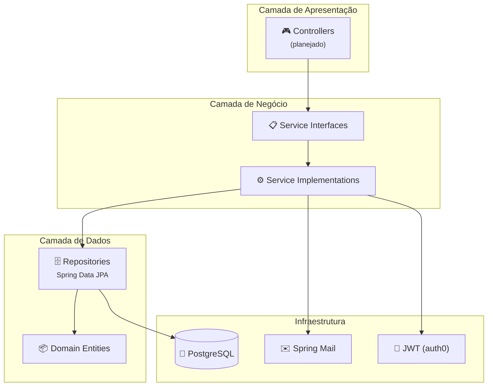
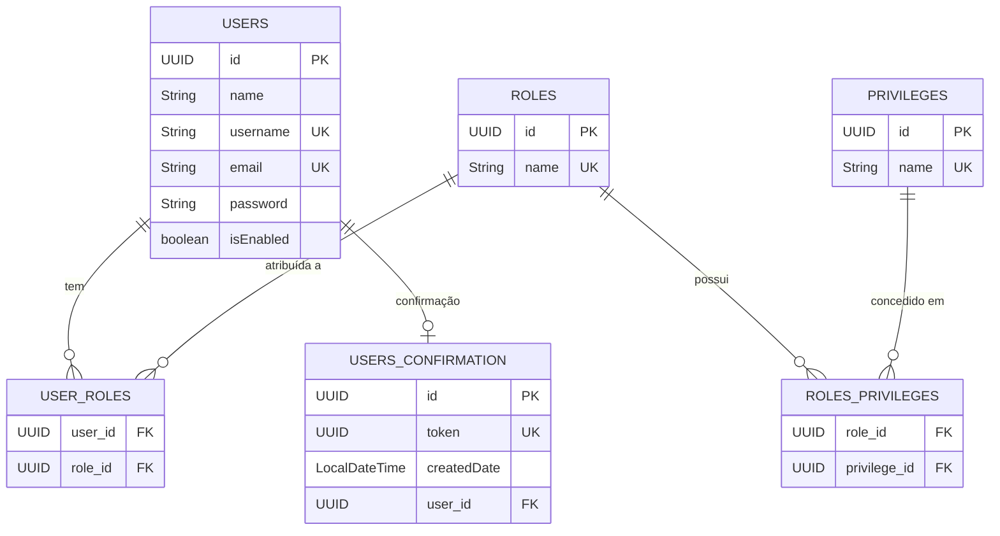

<p align="center">
  
  
  
  
  
</p>

<h1 align="center">🔐 Spring Boot Auth</h1>

<p align="center">
  <strong>API de autenticação e autorização com Spring Security, JWT e confirmação de conta por e-mail</strong>
</p>

<p align="center">
  <em>Modelo RBAC completo (User → Role → Privilege) com cobertura de testes unitários</em>
</p>

---

## 📋 Sumário

- [Sobre o Projeto](#-sobre-o-projeto)
- [Features](#-features)
- [Arquitetura](#-arquitetura)
- [Modelo de Dados](#-modelo-de-dados)
- [Stack Tecnológica](#-stack-tecnológica)
- [Pré-requisitos](#-pré-requisitos)
- [Configuração e Execução](#-configuração-e-execução)
- [Variáveis de Ambiente](#-variáveis-de-ambiente)
- [Estrutura do Projeto](#-estrutura-do-projeto)
- [Testes](#-testes)
- [Roadmap](#-roadmap)
- [Contribuição](#-contribuição)
- [Licença](#-licença)
- [Autor](#-autor)

---

## 💡 Sobre o Projeto

O **Spring Boot Auth** é uma API backend de autenticação e autorização construída com **Spring Boot 3** e **Java 21**. O projeto implementa um modelo de controle de acesso baseado em papéis (**RBAC** — Role-Based Access Control) com três níveis de granularidade: **Usuários**, **Papéis** (Roles) e **Privilégios** (Privileges).

A aplicação inclui um fluxo completo de **confirmação de conta por e-mail** utilizando tokens UUID com suporte a envio assíncrono de e-mails via **Spring Mail** e templates **Thymeleaf**.

---

## ✨ Features

- 🔑 **Autenticação JWT** — Tokens seguros com a biblioteca `auth0/java-jwt`
- 👥 **RBAC Multinível** — Hierarquia `User → Role → Privilege` com tabelas associativas
- 📧 **Confirmação de Conta** — Fluxo de verificação por e-mail com token UUID
- ✉️ **E-mail Assíncrono** — Envio de e-mails com `@EnableAsync` e Spring Mail
- 🎨 **Templates de E-mail** — Renderização HTML com Thymeleaf
- ✅ **Validação de Dados** — Bean Validation com `spring-boot-starter-validation`
- 🧪 **Testes Unitários** — Cobertura com JUnit 5 e Mockito
- 🐘 **PostgreSQL** — Banco de dados relacional em produção
- ⚙️ **Profiles** — Configuração separada para `dev` e `test`

---

## 🏗 Arquitetura

O projeto segue uma arquitetura em camadas com separação clara de responsabilidades:



| Camada | Pacote | Responsabilidade |
|--------|--------|------------------|
| **Domain** | `domain.user` | Entidades JPA e modelo de dados |
| **Repositories** | `repositories` | Acesso a dados via Spring Data JPA |
| **Services** | `services` / `services.impl` | Lógica de negócio com interfaces e implementações |
| **Exceptions** | `exceptions` | Exceções de domínio customizadas |

---

## 📊 Modelo de Dados



---

## 🛠 Stack Tecnológica

| Tecnologia | Versão | Propósito |
|------------|--------|-----------|
| **Java** | 21 (LTS) | Linguagem de programação |
| **Spring Boot** | 3.2.2 | Framework principal |
| **Spring Security** | 6.x | Autenticação e autorização |
| **Spring Data JPA** | 3.x | Persistência de dados |
| **Spring Mail** | 3.x | Envio de e-mails |
| **Thymeleaf** | 3.x | Templates de e-mail |
| **auth0/java-jwt** | 4.4.0 | Geração e validação de JWT |
| **PostgreSQL** | Latest | Banco de dados relacional |
| **Lombok** | Latest | Redução de boilerplate |
| **JUnit 5** | 5.x | Framework de testes |
| **Mockito** | 5.x | Mocking para testes unitários |
| **Gradle** | 8.5 | Build tool |

---

## 📌 Pré-requisitos

Certifique-se de ter as seguintes ferramentas instaladas:

- **Java JDK 21** — [Download](https://adoptium.net/temurin/releases/?version=21)
- **PostgreSQL 15+** — [Download](https://www.postgresql.org/download/)
- **Git** — [Download](https://git-scm.com/downloads)

> **Nota:** O projeto utiliza o Gradle Wrapper (`gradlew`), então **não é necessário instalar o Gradle** separadamente.

---

## 🚀 Configuração e Execução

### 1. Clone o repositório

```bash
git clone https://github.com/devrafaelsoares/spring-app-auth.git
cd spring-app-auth
```

### 2. Configure o banco de dados

Crie um banco de dados PostgreSQL:

```sql
CREATE DATABASE spring_auth_db;
```

### 3. Configure as variáveis de ambiente

Crie um arquivo `.env` na raiz do projeto ou exporte as variáveis no terminal:

```bash
# Aplicação
export APPLICATION_NAME=SpringBootAuth

# Banco de Dados
export DATABASE_HOST=jdbc:postgresql://localhost:5432/spring_auth_db
export DATABASE_USERNAME=seu_usuario
export DATABASE_PASSWORD=sua_senha

# JWT
export JWT_SECRET=sua_chave_secreta_jwt_aqui
export JWT_EXPIRATION=86400000

# E-mail (exemplo com Gmail)
export MAIL_HOST=smtp.gmail.com
export MAIL_PORT=587
export MAIL_USERNAME=seu_email@gmail.com
export MAIL_PASSWORD=sua_senha_de_app
```

### 4. Execute a aplicação

```bash
# Linux/macOS
./gradlew bootRun

# Windows
gradlew.bat bootRun
```

A aplicação estará disponível em `http://localhost:8080`.

---

## 🔐 Variáveis de Ambiente

| Variável | Descrição | Obrigatória | Exemplo |
|----------|-----------|:-----------:|---------|
| `APPLICATION_NAME` | Nome da aplicação | ✅ | `SpringBootAuth` |
| `DATABASE_HOST` | URL JDBC do PostgreSQL | ✅ | `jdbc:postgresql://localhost:5432/spring_auth_db` |
| `DATABASE_USERNAME` | Usuário do banco | ✅ | `postgres` |
| `DATABASE_PASSWORD` | Senha do banco | ✅ | `postgres` |
| `JWT_SECRET` | Chave secreta para assinar tokens JWT | ✅ | `minha-chave-secreta-256-bits` |
| `JWT_EXPIRATION` | Tempo de expiração do token (ms) | ✅ | `86400000` (24h) |
| `MAIL_HOST` | Host do servidor SMTP | ✅ | `smtp.gmail.com` |
| `MAIL_PORT` | Porta do servidor SMTP | ✅ | `587` |
| `MAIL_USERNAME` | E-mail para envio | ✅ | `email@gmail.com` |
| `MAIL_PASSWORD` | Senha ou App Password | ✅ | `xxxx xxxx xxxx xxxx` |

---

## 📁 Estrutura do Projeto

```
spring-app-auth/
├── src/
│   ├── main/
│   │   ├── java/br/devrafaelsoares/SpringBootAuth/
│   │   │   ├── domain/
│   │   │   │   └── user/
│   │   │   │       ├── User.java              # Entidade de usuário (UserDetails)
│   │   │   │       ├── Role.java              # Entidade de papel (RBAC)
│   │   │   │       ├── Privilege.java         # Entidade de privilégio
│   │   │   │       └── UserConfirmation.java  # Token de confirmação de conta
│   │   │   ├── exceptions/
│   │   │   │   ├── role/
│   │   │   │   │   └── RoleNotFoundException.java
│   │   │   │   └── user/
│   │   │   │       ├── UserNotFoundException.java
│   │   │   │       ├── UserExistsException.java
│   │   │   │       └── UserConfirmationTokenException.java
│   │   │   ├── repositories/
│   │   │   │   ├── UserRepository.java
│   │   │   │   ├── RoleRepository.java
│   │   │   │   ├── PrivilegeRepository.java
│   │   │   │   └── UserConfirmationRepository.java
│   │   │   ├── services/
│   │   │   │   ├── UserService.java           # Interface
│   │   │   │   ├── RoleService.java           # Interface
│   │   │   │   ├── UserConfirmationService.java  # Interface
│   │   │   │   └── impl/
│   │   │   │       ├── UserServiceImpl.java
│   │   │   │       ├── RoleServiceImpl.java
│   │   │   │       └── UserConfirmationServiceImpl.java
│   │   │   └── SpringBootAuthApplication.java
│   │   └── resources/
│   │       ├── application.yml           # Configuração principal
│   │       ├── application-dev.yml       # Profile de desenvolvimento
│   │       └── application-test.yml      # Profile de testes
│   └── test/
│       └── java/br/devrafaelsoares/SpringBootAuth/
│           ├── services/impl/
│           │   ├── UserServiceImplTest.java
│           │   ├── RoleServiceImplTest.java
│           │   └── UserConfirmationServiceImplTest.java
│           └── SpringBootAuthApplicationTests.java
├── build.gradle          # Dependências e plugins
├── settings.gradle       # Configuração do projeto Gradle
├── gradlew               # Gradle Wrapper (Linux/macOS)
├── gradlew.bat           # Gradle Wrapper (Windows)
├── LICENSE               # Licença MIT
└── README.md
```

---

## 🧪 Testes

O projeto possui testes unitários para todas as implementações de serviço utilizando **JUnit 5** e **Mockito**:

| Classe de Teste | Cobertura |
|----------------|-----------|
| `UserServiceImplTest` | 7 cenários — CRUD, lookup, validação de existência, `loadUserByUsername` |
| `RoleServiceImplTest` | 4 cenários — Busca por nome, validação de existência, exceções |
| `UserConfirmationServiceImplTest` | 4 cenários — Busca por token, criação, exclusão, exceções |

### Executar todos os testes

```bash
./gradlew test
```

### Executar com relatório detalhado

```bash
./gradlew test --info
```

Os relatórios HTML são gerados em `build/reports/tests/test/index.html`.

---

## 🗺 Roadmap

Funcionalidades planejadas para as próximas versões:

- [ ] **Controllers REST** — Endpoints de registro, login, confirmação e refresh token
- [ ] **Security Configuration** — `SecurityFilterChain`, filtro JWT e `AuthenticationProvider`
- [ ] **DTOs** — Request/Response objects para desacoplar entidades da API
- [ ] **Global Exception Handler** — `@RestControllerAdvice` com respostas padronizadas
- [ ] **Privileges nas Authorities** — Mapear privilégios além dos roles no `getAuthorities()`
- [ ] **Flyway Migrations** — Versionamento de schema de banco de dados
- [ ] **Docker & Docker Compose** — Containerização da aplicação e dependências
- [ ] **Documentação OpenAPI** — Swagger UI com `springdoc-openapi`
- [ ] **Rate Limiting** — Proteção contra brute-force no login
- [ ] **Refresh Token** — Rotação de tokens com armazenamento seguro
- [ ] **Password Reset** — Fluxo de recuperação de senha por e-mail
- [ ] **Testes de Integração** — Testes end-to-end com Testcontainers
- [ ] **CI/CD** — Pipeline com GitHub Actions

---

## 🤝 Contribuição

Contribuições são bem-vindas! Para contribuir:

1. **Fork** o repositório
2. Crie uma **branch** para sua feature:
   ```bash
   git checkout -b feature/minha-feature
   ```
3. Faça **commit** das suas alterações:
   ```bash
   git commit -m "feat: adiciona minha feature"
   ```
4. Faça **push** para a branch:
   ```bash
   git push origin feature/minha-feature
   ```
5. Abra um **Pull Request**

### Convenção de Commits

Este projeto segue o padrão [Conventional Commits](https://www.conventionalcommits.org/):

| Prefixo | Descrição |
|---------|-----------|
| `feat:` | Nova funcionalidade |
| `fix:` | Correção de bug |
| `docs:` | Documentação |
| `test:` | Adição ou modificação de testes |
| `refactor:` | Refatoração de código |
| `chore:` | Tarefas de manutenção |

---

## 📄 Licença

Distribuído sob a licença **MIT**. Veja [LICENSE](LICENSE) para mais informações.

---

## 👤 Autor

<table>
  <tr>
    <td align="center">
      <a href="https://github.com/devrafaelsoares">
        <br />
        <sub><b>Rafael Soares</b></sub>
      </a>
    </td>
  </tr>
</table>

---

<p align="center">
  Feito com ❤️ por <a href="https://github.com/devrafaelsoares">Rafael Soares</a>
</p>
